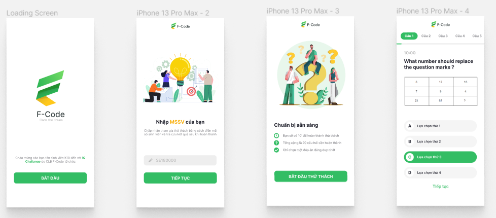
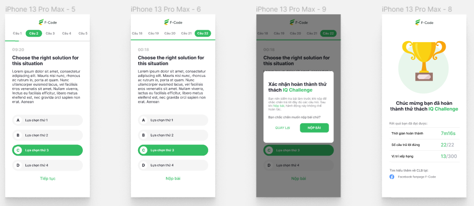

# IQ Challenge - Frontend

## Description

A quiz game website of F-code club for the orientation to welcome K18 of FPT University HCM.

The player will receive a card with a QR code to have only 1 chance to add name and play.

Here is [the demo](https://iq-challenge.vercel.app/)

<!-- Here is [the Backend](https://github.com/kien123456k/minigameQR-backend) that this app using. -->

## Technology

-   Frontend
    -   Next with TypeScript: The React Framework for the Web
-   Backend
    -   Spring Boot
    -   MySQL

## Some Preview Images

# License & copyright

© Tran Hai Dang, FPT University TP.HCM
Licensed under the [MIT LICENSE](LICENSE).
